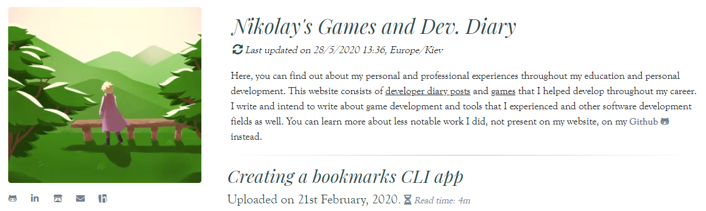

<p align="center">
  <a href="" rel="noopener">
 </a>
</p>

# Nikolay's Developer Diary and Games</h3>

## About <a name = "about"></a>
This repository contains all the diary posts in raw markdown format, including the posts for each game in the portfolio section, and finally, the source code which builds the website.

## Getting Started <a name = "getting_started"></a>
### Installing

```
$ git clone https://github.com/Super-Lovers/dev-diary.git
$ cd dev-diary/
$ npm install
```

## Usage <a name = "usage"></a>

```
$ gulp watch
```
Automatically builds the site whenever changes are made to the source code of diary/game directories or new assets are added.

OR (preferred)

```
$ gulp generate-posts
```
Builds the diary section of the site using the diary directory

```
$ gulp generate-game-pages
```
Builds the portfolio section of the site using the games directory

```
$ gulp minify
$ gulp compress-images
```
Compresses all the source code and assets to their new respective directories indicated by a compressed/min postfix