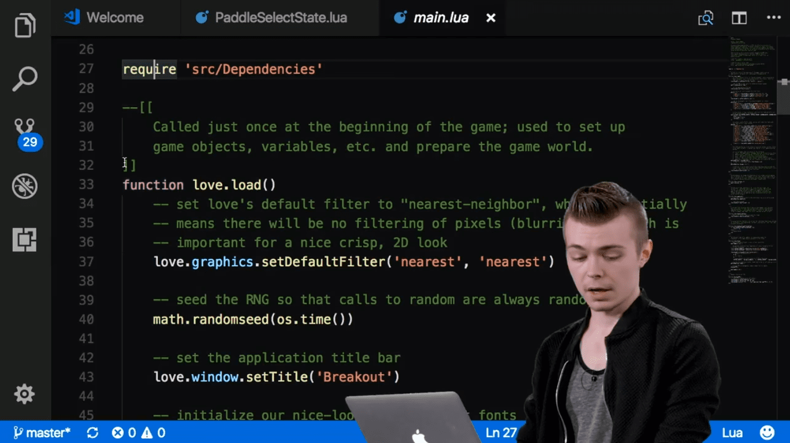

# Lua and Love2d for game jams

## Uploaded on 10th June, 2020

<span class="drop">G</span>ame jams are a good opportunity to try out new technologies. I've wanted to try some programming languages for game development such as Lua or writing vanilla Javascript, since current trends lean towards C#, Javascript game dev. frameworks and often times C++ frameworks too.

Lua is a really quick multi-paradigm language to learn, at least in terms of syntax and it has many third-party libraries to speed up your development process. If you don't have the time or energy during a game jam to implement some features, Love2d has plenty of libraries made by other people or provided by the framework [1].

Love2d is similar to other frameworks I have tried in the past like phaser v2/3 and CreateJs. The structure of your project is familiar and in terms of syntax there are obviously a few differences.

Loading sprite assets in Love2d:

```lua
local tiles = {
    ["safe-tile"] = love.graphics.newImage("assets/images/tile-safe.png"),
    ["transitioning-tile"] = love.graphics.newImage("assets/images/tile-transitioning.png"),
    ["corrupted-tile"] = love.graphics.newImage("assets/images/tile-corrupted.png")
}
```

Loading sprite assets in CreateJs:

```javascript
queue.loadManifest([
    {id: 'big_rock', src: './assets/rocks/big_rock.png'},
    {id: 'big_rock_magma', src: './assets/rocks/big_rock_magma.png'},
    {id: 'medium_rock', src: './assets/rocks/medium_rock.png'},
    {id: 'medium_rock_mud', src: './assets/rocks/medium_rock_mud.png'},
    {id: 'small_rock', src: './assets/rocks/small_rock.png'},
    {id: 'tiny_rock', src: './assets/rocks/tiny_rock.png'}
]);
```

They all have the same life cycle, with a little difference accounting for platforms of deployment provided by the frameworks, but the scripts feel the same. Configuring the project details like window size, icon and such is done in a single file, with different options for aesthetics. It is not as robust as a full-fledged game engine, but more than enough for quick prototyping:

```lua
t.window.title = "Game Title"
t.window.icon = "assets/images/game-icon_01.png"
t.console = true

--- 640x and 1024x
t.window.width = 640
t.window.height = 640
t.window.resizable = false
t.window.borderless = true -- for development only
t.window.fullscreen = false -- for development only
```

Lua makes it very easy to organize your files and write complex OOP code. If you don't have some practice with C++, you might be a bit confused at the start about how including code together between files flows. There is a really helpful lecture I watched to get up to speed with game development in Love2d that I recommend for you folk (click image to open):

<a href="https://www.youtube.com/watch?v=pGpn2YMXtdg">
	
</a>

I can't tell why exactly I love the feel of writing Lua code but it probably has to do with the syntax leaving out the curly braces, semicolon and such and replacing it with words like how it is in Pascal. I'm not a fan of extra letters in syntax, so I try to use alternatives that remove this excess, such as Stylus for CSS or Pug for HTML (preprocessors in general) for web development.

CSS example with extra syntax:
```css
#prompt {
  position: absolute;
  top: 150px;
  left: 50%;
  width: 200px;
  margin-left: -100px;
}
```


Without extra syntax:

```stylus
#prompt
  position: absolute
  top: 150px
  left: 50%
  width: w = 200px
  margin-left: -(w / 2)
```

Love2d was easy to learn as the documentation has a lot of tutorials both made by the team or by other people. Its quick to pick up the framework and easy to setup a template, working project to prototype with. For game jams I recommend Love2d since its a really fun and lightweight choice. As long as you organize your project well, It wont be an issue to collaborate with other people.

#### Resources

1. Tools
    * [List of awesome love2d resources](https://github.com/love2d-community/awesome-love2d)
    * [Awesome Lua resources](https://github.com/LewisJEllis/awesome-lua)
2. [Learn Lua in Y minutes](https://learnxinyminutes.com/docs/lua/)

