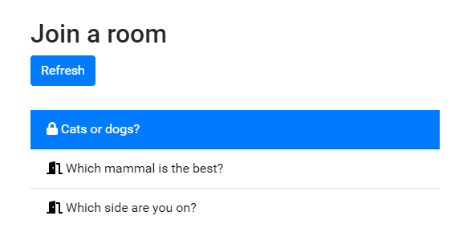
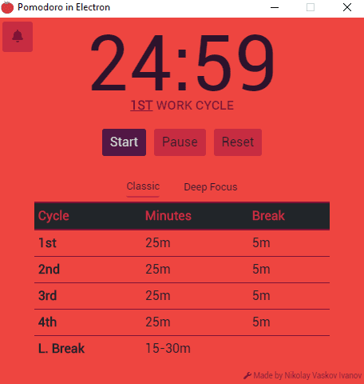

# Learning ElectronJS

## Uploaded on 10th July, 2020

<span class="drop">D</span>eveloping with ElectronJs to me isn't much different from making a web application, but that probably had to do with my currently basic understanding of it.

Looking at some [project ideas](https://github.com/florinpop17/app-ideas) to tackle, I decided to make something with Electron since many popular platforms are developed with it and I became really curious. I made two easy applications, one called Pomodoro, which I now actively use, and another called this-or-that, inspired from the North American LCS show.


This or that uses a MongoDB instance, as it is a bit more complicated and has to store sessions for different users, so that they can join or not depending on if there is a password for that room. The password string uses a SHA512 algorithm to be encrypted.

````json
{
    // This is a room instance in MongoDB
    "name": "Cats or dogs?",
    "password": "ee26b0dd4af7e749aa1a8ee3c10ae9923f6...",
    "slides": [{
        "title": "Slide title",
        "thisImg": "http://placekitten.com/300/200",
        "thisText": "",
        "thatImg": "http://placedog.net/300/200",
        "thatText": "",
        "html": ""
}
````



With Electron, it was easy to use the library and create a functional, cross-platform prototype. The two main parts about creating an Electron application is using the life-cycle callbacks and assigning scripts to individual browser windows. If other modules are necessary for your application, you enable them separately or include them in your scripts:

````javascript
function createWindow() {
	mainWindow = new BrowserWindow({
		width: 450,
		height: 450,
		useContentSize: true,
		icon: './favicon/favicon-32x32.png',
		webPreferences: {
			nodeIntegration: true
		},
	});

	setupWindow();

    // this is the markup file which will be rendered
    // on this browser window.
	mainWindow.loadFile('./index.html');   									
}

// here I configure how the browser window will be
// displayed after instantiated
function setupWindow() {
	mainWindow.resizable = false;
	mainWindow.autoHideMenuBar = true;
	mainWindow.setMenuBarVisibility(false);
	mainWindow.center();
}
````

For a Pomodoro clock application, I mostly worked with the tray and notification modules, since it's basically a glorified countdown. Electron gives you convenient access to create notifications and a tray icon with hover functionality, although the tray icon does not work perfectly in Linux and for me could not run without crashing.

````javascript
// Creating tray instance and setting the app icon
tray = new Tray('./favicon/favicon-32x32.png');
   ...
   
const trayMessage = `${currentCycle.title} - ${isTimerPaused ? 'Paused' : 'Active'} \n${timer.innerText}`;

// This message will then be displayed once you
// hover over the tray icon
ipc.send('updateTrayTimer', trayMessage);

// And this is how you send a notification
// to the operating system
new Notification('Pomodoro', {
    body: currentCycle.title + ' has passed.',
    icon: 'images/tomato.png'
});
````


The application simply loops between pre-defined cycles of work and breaks. Once a cycle completed, the user is notified and the next one begins and so on until the last cycle finishes the session.

`````javascript

const classicCycles = [
	new Cycle('1st Work Cycle', '<b><u>1st</u></b> Work Cycle', 0),
	new Cycle('Break - 1st Work Cycle', '<b><u>Break</u></b> - 1st Work Cycle', 5),
	new Cycle('2nd Work Cycle', '<b><u>2nd</u></b> Work Cycle', 25),
	new Cycle('Break - 2nd Work Cycle', '<b><u>Break</u></b> - 2nd Work Cycle', 5),
	new Cycle('3rd Work Cycle', '<b><u>3rd</u></b> Work Cycle', 25),
	new Cycle('Break - 3rd Work Cycle', '<b><u>Break</u></b> - 3rd Work Cycle', 5),
	new Cycle('4th Work Cycle', '<b><u>4th</u></b> Work Cycle', 25),
	new Cycle('Long Break', 'Long Break', 30),
];

const deepFocusCycles = [
	new Cycle('1st Work Cycle', '<b><u>1st</u></b> Work Cycle', 90),
	new Cycle('Long Break', 'Long Break', 30),
];
`````

