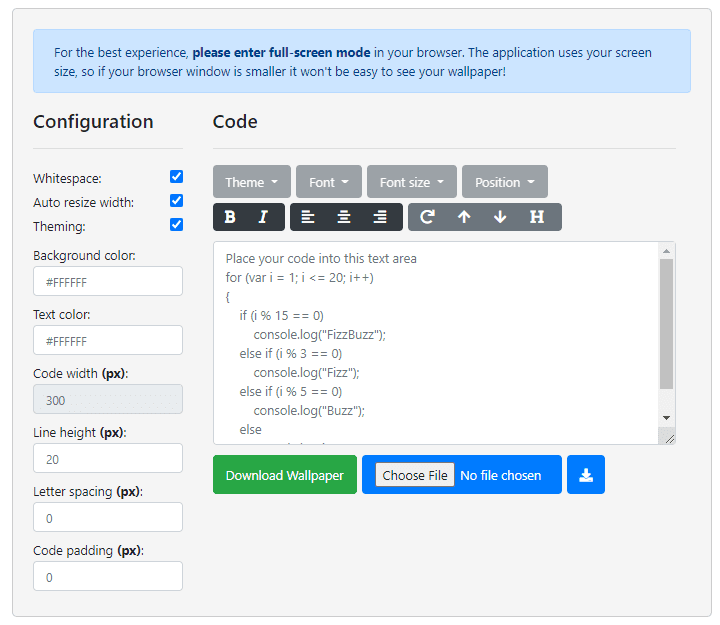
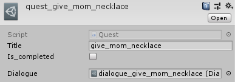
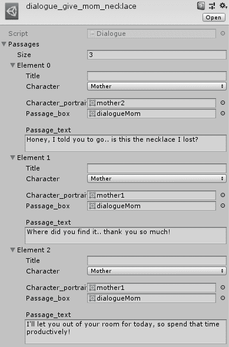
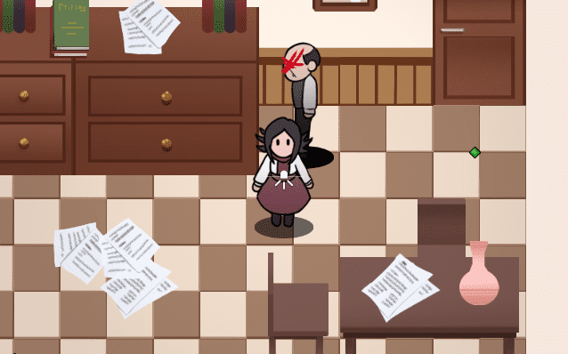

# Wallpaper generator and Candles update

## Uploaded on 7th October, 2020

<span class="drop">I</span>t's been a while (a month) since I last wrote about any updates to the diary, so I'm glad I've made progress that I can share on two previous projects. Unlike the bookmarks manager's case, I didn't update these projects because someone wanted me to or was using them, but because I wanted to improve them and see how bad the programming is.
 The first project is the wallpapers generator, since there were features that I desperately think were needed to make the application more useful and easier to use. For a reason beyond my understanding, I didn't think of having configuration files that you can download or upload when you want to save your wallpaper settings and use/update them again in the future.

</video>

The code behind it is just a javascript object that gets serialized and saved locally to your system. Then, using the upload button, when you select that json file to use, it will deserealize it and update the wallpaper with the new key values.

````javascript
uploadButton.addEventListener('change', (event) => {
	const file = event.target.files[0];
	let config;

	if (file) {
		const reader = new FileReader();
		reader.readAsText(file, 'UTF-8');
		reader.onload = (e) => {
			config = JSON.parse(e.target.result);
			loadConfig(config);
		};
	}
});
````

The actual code that is being parsed, is just one big json object with all the properties of the wallpaper:

````json
{
    "backgroundColor": "#000000",
    "textColor": "#ffffff",
    "codeWidth": "400",
    "lineHeight": "",
    "letterSpacing": "",
    "codePadding": "",
    "whitespace": false,
    "toggleAutoWidth": false,
    "toggleTheming": false,
    "codeTheme": "https://wallpaper-code-gen.onrender.com/themes/default.css",
    "fontName": "terminus",
    "fontSize": "18px",
    "position": "Middle",
    "code": "There comes a time when all men must bear the <u>weight</u> of their responsibility\n<hr style=\"background:gray;\"><span style=\"color:red;\">-- Takeshi Kido </span>",
    "bold": false,
    "italic": false,
    "textAlignLeft": false,
    "textAlignMiddle": true,
    "textAlignRight": false,
    "transform": false,
    "uppercase": false,
    "lowercase": false,
    "capitalize": false
}
````

This will allow us to save all the wallpapers (configs) locally, so that they can be reconstructed in the future. The second project I updated is Candles, one of the first game jam games I worked on. The game was made in the Global Game Jam in 2019, and I was really inexperienced back then. The updates to the game include a re-write of the dialogue, story progression, and realm-transition modules, including fixing the codebase being old and terrible to work on. The dialogue of the game was previously written directly in the codebase, which when I saw, wished for a quick death before I went on to read another line of my code.


I separated the quests and the dialogue implemetation into two scriptable object classes, so that it's easier to create new dialogue and quests and use them in conjunction. All you have to do is just drag the dialogue object into the quest's field, and it's also easier for me to test runtime in the editor:

</video>

</video>

Next up on the list was the transition between realms mechanic. The idea is that you interact with a candle, and it moves your character to a new dimension. The character actually stays in place, while all the furniture and objects in the game change their appearance according to the sprite given to it for the new realm. This is done using the observer pattern, so all objects update when the realms event is called.

<video src="../../../../diary/Other/2020/October/images/realm_transition.mp4" controls="" autoplay="" loop="" style="display: block;"></video>

````c#
// Observer main event code
// **************************
public void ChangeRealm() {
	player.Turn(current_realm);

	for (int i = 0; i < quest_model.state_controllers.Count; i++) {
		quest_model.state_controllers[i].UpdateState();
	}

	for (int i = 0; i < furniture.Count; i++) {
		furniture[i].Turn(new_realm);
	}
}

...

// Furniture and objects code
// **************************
    public void Turn(Realm realm) {
        if (realm == Realm.Human) {
            sprite_renderer.sprite = human_realm_sprite;
        } else if (realm == Realm.Ghost) {
            sprite_renderer.sprite = ghost_realm_sprite;
        }
    }
````

Aside from the codebase, I updated the interface by changing the fonts for the dialogue and panels, made the game screen smaller, and spent some time decorating the map more, since most of the gameplay revolves around exploring the mansion and finding interesting things that can progress the story:

