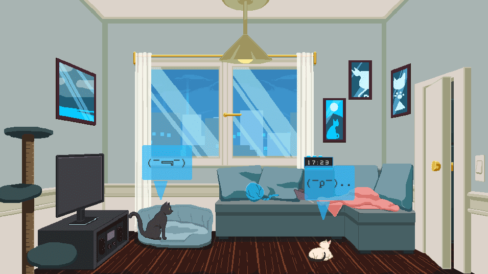
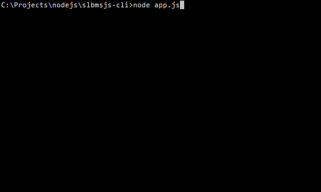
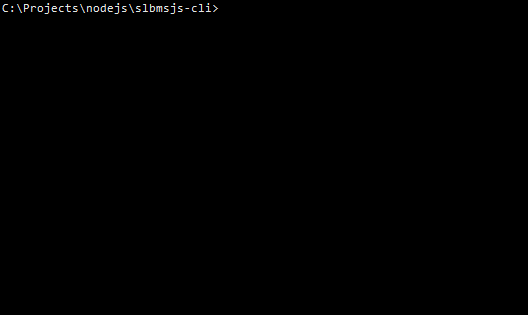

# Rainy Day and slbms.js update

## Uploaded on 8th September, 2020

During this summer vacation, I was thinking of updating past games and projects that either weren't completed in their expected state or simply didn't have a clear end goal. Sine of them were done during the game jams, so after working on them we were generally burned out or tired and had university right after. So, now is an appropriate time to get busy. The first project I updated was Rainy Day (might make one or two optimizations soon as well), a game jam entry from the [TASJAM LITE](https://itch.io/jam/tasjam-lite-2) encouraging a chilled out and relaxing experience. In short, Rainy Day is a simple pet simulator where you take care of three cute cats.

The game wasn't finished in time for the Jam because judging from the disgusting state of the programming, I had no idea what I was doing. The cats were supposed to behave like normal organic cats but they could barely walk around aimlessly without being distinguished as artificial intelligence with two brain cells. They could at least eat from their bowls, but in my rush, all those mechanics (behavior, eating) were in a stinking state and much of the programming was useless. So, I wrote all the cat behavior from scratch and made a pseudo-AI cat that could easily switch states from walking to standing, eating or sleeping without looking like terrible AI.

<video src="../../../../diary/Other/2020/September/images/cats_ai.mp4" controls autoplay="" loop="" style="display: block;"></video>

As you can see, I also made the cats express their mood or emotion using Japanese kaomoji, since they were easier to edit compared to custom cat emoji or graphics. I updated the cooking programming as well. With it, I began working on the user interface, since our focus on it during Jams is minimal and more turned to the functional aspect. As soon as I realized that the less interface there is, the less distracting the game becomes. And mostly because we kind of sucked at creating good interface during a rush. I tried to strip as much of it while keeping the aesthetic in this chill mood, meaning you can focus on one thing on the screen at a time rather than having too much information. Whenever the interface is needed, it will show up, and when it isn't the player can focus on the cats. 

<video src="../../../../diary/Other/2020/September/images/game_ui.mp4" controls autoplay="" loop="" style="display: block;"></video>

That's pretty much where my focus was on Rainy Day. The second project I updated was the bookmarks viewer (now manager too) node.js application. User "5c0tt-b0t" on GitHub created an issue for the project requesting a tagging system. I thought..

> What the f***, somebody actually uses my program and wants an update.

and I didn't notice the request until thirteen days later, but thankfully he was cool about it. I immediately updated the application by adding a tagging system which lets you mark any number of bookmarks and assign tags to them:

You can then browse those tags and when you update your bookmarks, it will remember the tags you assigned to those specific bookmarks too (stored locally):

I'm really glad I got to look back on the horror of my past programming and to update it a little here and there. I'm hoping to keep doing so in the future.