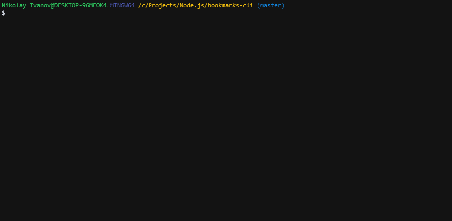

# Creating a bookmarks CLI app
## Uploaded on 21st February, 2020

When you bookmark online pages like me all the time and switch browsers a lot, it becomes irritating to get used to every browser's different implementation of a bookmarks viewer interface. That's why I decided to make one called SLBMS where it won't matter what browser I'm using. When you use Linux, Mac or Windows, the one thing that stays constant is having a console, which is why I thought about making my bookmarks application a CLI in Node.js. I'm not very good at Node.js so the implementation is not great and is fairly simple in design, which is why I call it a viewer rather than a manager app. 

SLBMS uses the bookmarks html files that browsers allow you to export as a backup to give you different actions to explore your bookmarks. As of this post's release, the viewer lets you group bookmarks by domains, so if I had ten bookmarks of any youtube video, it would group them inside a youtube folder which you can explore:

As you can see, there is grouping, sorting and searching by using keywords. Depending on what you intend to look for and if you know what you are looking for in the first place, you can use the respective methods of searching. Sorting allows you to sort by newest or oldest bookmarks that were added:

The keywords search uses a fuzzy algorithm extended by the Fuse.js library. Aside from that, there is an option in the settings menu which refreshes the bookmarks if you added a new file or replaced the existing one from the bookmarks html files folder:

Naturally, when you press enter on a bookmark entry, it will automatically open the page using the default browser setting of your operating system. An application like this took me two days, but for an experienced web developer, you can make this in less than a day and it'll provide a lot more flexibility between workstations. It was a cool challenge to make a CLI, so I recommend it to any new web developer. It just feels weird having to use CLIs so much without having tried to make one yourself.
