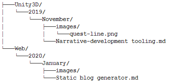
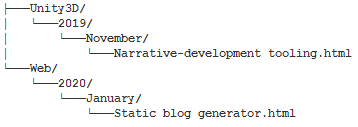
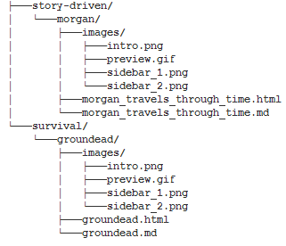

### Making my light, markdown posts generator

##### Uploaded on 26th January, 2020

I often think about writing down my thoughts about experiences and things I learn, so when I became curious of how I would do that while also sharing this information to other people, a blog or developer diary seemed obvious. I wanted to automate the process of creating my own "posts" by writing on markdown, since it is standard and easy to use, and upload it somewhere automatically so that it is easily accessible for the future. 

After researching about the idea, I found a post from Gaby ([https://gaby.dev/posts/static-site-generator](https://gaby.dev/posts/static-site-generator)) that describes it similarly to how I imagined, although his implementation of it is much more complex and better than mine due to my lack of experience.

The way I pictured the post history was by separating the topics and sorting their posts chronologically by years > months > posts. It will be cluttered but for my convenience, it is much easier to find specific posts:

After writing my post on a markdown file, and suppling it with images from a folder if necessary. The generator will then create an html file by extracting the markdown content and converting everything that is not html into html. This html file is created by first retrieving a base page, one with no content but header information and sidebar navigation that every page must have on the website, and then combines it with the markdown file to complete the post's page. All the posts of the markdown files form a DOM folder where they are stored. Due to load performance, the images are accessed through the markdown's folder instead of duplicating them:

The file structure of the posts is then used to generate the navigation bar on the left side of the website. The games section works in exactly the same way, except that instead of a chronological-based file structure, it only uses genres:

Some of the annoying bits of developing this tool was making sure all the links between the folders were working correctly and by making sure the content of the sidebar matched that of the rest of the pages. Permissions for reading and editing files after changes are made to it, such as testing how a post would look like before uploading it can be a nuisance.