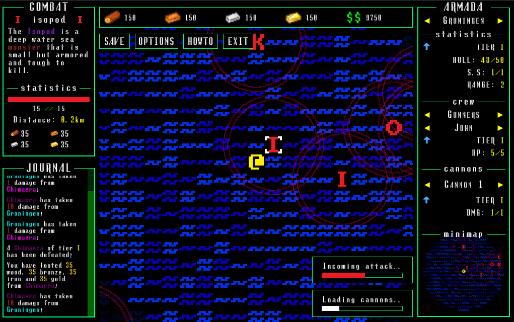

# Take Back the Seas
#### ascii

Experience being in control of a naval fleet of two  ships. Managing its crew, weapons and various parameters that make it  stay afloat.  

Battle sea creatures such as kraken, octopods, isopods and so on! The  game gives a lot of breathing room and the opportunity to explore  different areas of the world in between combat. The combat itself is  passive, as you manages a fleet and its potential combat capability,  instead of the dictating how the battle is taking place. 

## Controls

You play the game by using the W S A D or Arrow keys to give your fleet a direction to sail in and you can stop the fleet from moving using the X or K buttons.  

## Install Instructions

Unzip the downloaded file, open the new folder, and run the Take Back The Sea executable file with the blue and orange icon.