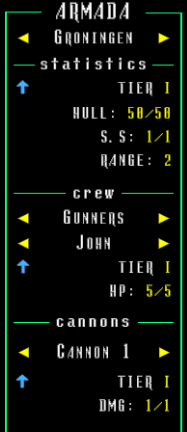

# Take Back the Seas
## Uploaded on 14th December, 2020
## desktop ascii all
<span class="game-link"><i class="fas fa-link"></i> Game Page: <a href="https://back-body-hurts.itch.io/take-back-the-seas">https://back-body-hurts.itch.io/take-back-the-seas</a></span>

<p class="description">Experience being in control of a naval fleet of two ships. Managing its crew, weapons and various parameters that make it stay afloat. Battle sea creatures such as kraken, octopods, isopods and so on! The game gives a lot of breathing room and the opportunity to explore different areas of the world in between combat. The combat itself is passive, as you manages a fleet and its potential combat capability, instead of the dictating how the battle is taking place. I wanted to create an ASCII, rogue-like experience because I always thought it had a certain charm and a retro feel to it. Exploration is a mysteriously captivating and exciting concept and I focused on it for this game. Because of this, the game consists of a large ocean that can be filled with all sorts of interesting entities. You explore using an armada of ships that you micro/macro manage:</p>

<video src="../../../games/ascii/take_back_the_seas/images/gameplay.mp4" controls="" autoplay="" loop="" style="display: block;"></video>

The ships in your armada have a crew you can expand the longer you play the game. Different classes of the crew work different jobs to maintain the ship's function. If all of your gunners are gone, no one will be able to fire the cannons or if your doctors are dead, no one will be able to heal the wounded crew and they will eventually die. All of this information is available in the Armada panel:



The world generation is pretty simple, it uses a basic walking agents algorithm to create small pockets of islands on an empty array of water tiles:

````c#
private void GenerateWorld() {
    // The dimensions of the world must first be retrieved before
    // the generation process occurs.
    int worldWidth = 0;
    int worldDepth = 0;

    switch (GameManager.Instance.WorldSize) {
        case "Small": worldWidth = 100; worldDepth = 100; break;
        case "Medium": worldWidth = 250; worldDepth = 250; break;
        case "Large": worldWidth = 400; worldDepth = 400; break;
    }

    // Think of sectors as continents or large bodies of mass on the
    // planet. We need to populate those large sections in order to
    // imitate the vast space of a planet and seperate them by names.
    foreach (Sector sector in Sectors) {
        GenerateOcean(sector, sector.Terrain, new int[worldWidth, worldDepth]);

        // Once we find the sector that was last active in the game,
        // we generate its environment.
        if (sector.Active) {
            GenerateHostiles(sector);
        }
    }
}
````

The agents are created at random positions on the array and they go in directions until a good number of land tiles are created:

````c#
private void GenerateLand(Sector sector, int[,] terrain, int approximateSize) {
    int currentSize = 0;

    int maxWidth = terrain.GetLength(0);
    int maxDepth = terrain.GetLength(1);

    int minWidth = 0;
    int minDepth = 0;

    Vector2 randomMapPoint = new Vector2(
        Random.Range(minWidth, maxWidth),
        Random.Range(minDepth, maxDepth)
    );

    int x = (int)randomMapPoint.x;
    int y = (int)randomMapPoint.y;

    // Initial direction for the agent to start with
    string newDirection = "Forward";
    string previousDirection = "Forward";
    while (currentSize < approximateSize) {
        if (newDirection == "Forward" && y - 1 > minWidth) { ... }
        else if (newDirection == "Backward" && y + 1 < maxDepth) { ... }
        else if (newDirection == "Left" && x - 1 > minWidth) { ... }
        else if (newDirection == "Right" && x + 1 < maxWidth) { ... }

        while (newDirection == previousDirection) {
            // Getting a new direction for the next iteration of the
            // agent's object population
            int randomDirectionIndex = Random.Range(0, 4);
            if (randomDirectionIndex == 0)
                newDirection = "Forward";
            else if (randomDirectionIndex == 1)
                newDirection = "Backward";
            else if (randomDirectionIndex == 2)
                newDirection = "Left";
            else if (randomDirectionIndex == 3)
                newDirection = "Right";
        }

        currentSize++;
    }

    sector.Terrain = terrain;
}
````


After the world is generated, I populate it with sea creates (monsters) which are currently all hostile and fight the player whenever he is too close. That's the whole thing about the world generation. Of course, ships have some form of scouting, so I've included a minimap that can also be expanded the more you progress:

<video src="../../../games/ascii/take_back_the_seas/images/minimap.mp4" controls="" autoplay="" loop="" style="display: block;"></video>

The minimap is basically a second camera that changes its properties based on the player's armada upgrades. Those were the most interesting aspects I wanted to touch on. I will be updating the game in the future or possibly re-writing it from scratch on a different engine or more suitable set of tools and libraries for it.

<div class="credits">
  <p>... project created by</p>
</div>

<div class="card-deck">
  <div class="card">
    <div class="icon">
      <i class="profession-icon fas fa-code"></i>
    </div>
    <div class="card-body">
      <h5 class="card-title">Nikolay Ivanov</h5>
      <p class="card-text">Programmer and designer for the entire project.</p>
    </div>
  </div>
  <div class="card" style="visibility:hidden;">
  </div>
</div>