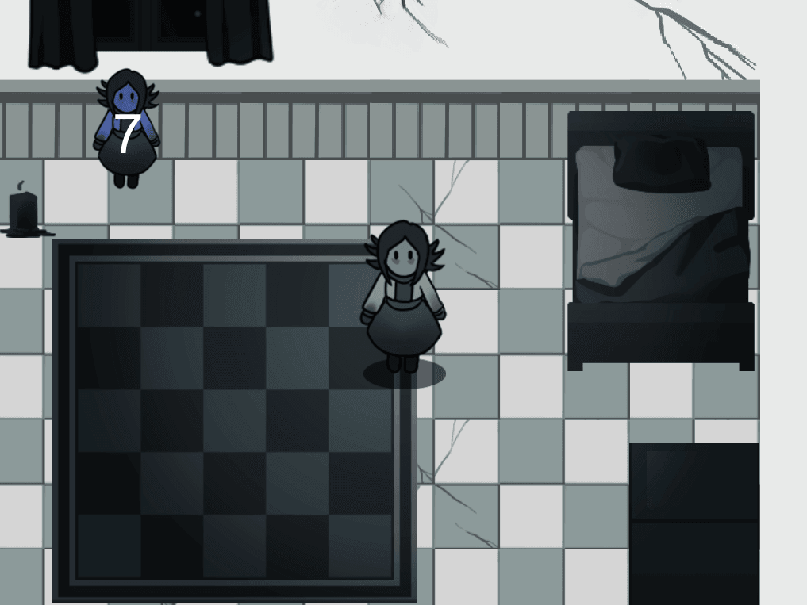
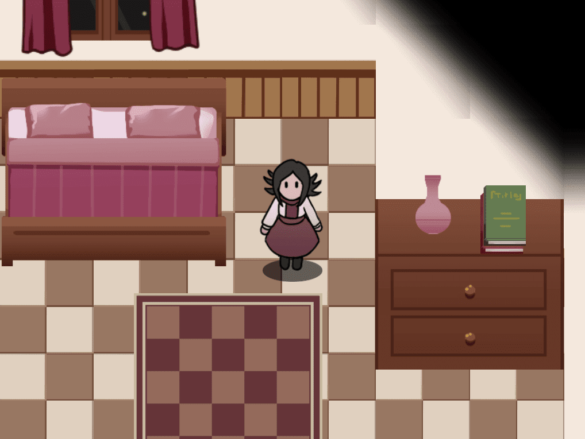

    

        
    

    

        
    

# Candles
## desktop gamejam all

In Candles, You are a girl called Jane that is struggling with an unfortunate relationship with her family and to cope, she decides it is time to go, and so your adventure to escape begins. This game was made for the Global Game Jam 2019 in two days and then updated after the jam.

###### Credits
* Game Artist - Roger Recaldini
* Game Designer - Youri Mulder
* Game Developer - Nikolay Ivanov 
