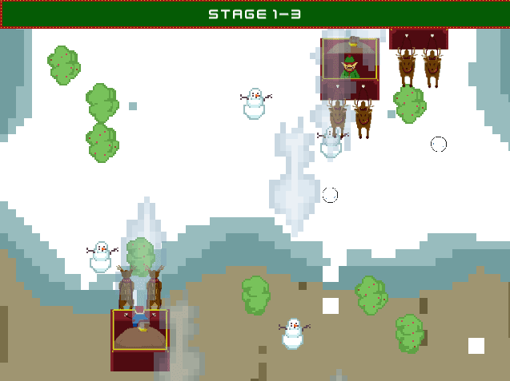
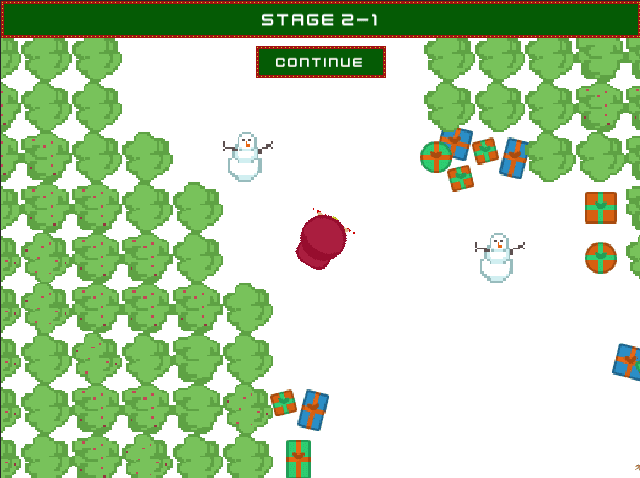
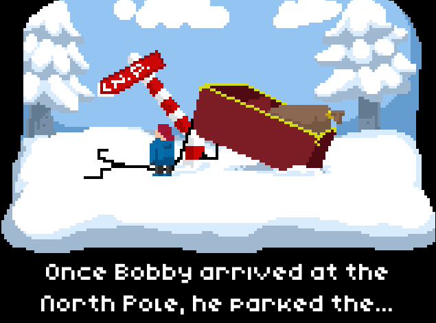

  <ol class="carousel-indicators">
    <li data-target="#carouselExampleIndicators" data-slide-to="0" class="active"></li>
    <li data-target="#carouselExampleIndicators" data-slide-to="1"></li>
    <li data-target="#carouselExampleIndicators" data-slide-to="2"></li>
  </ol>
  

    

      
    

    

      
    

    

      
    

  

  <a class="carousel-control-prev" href="#carouselExampleIndicators" role="button" data-slide="prev">
    
    Previous
  </a>
  <a class="carousel-control-next" href="#carouselExampleIndicators" role="button" data-slide="next">
    
    Next
  </a>

# Naughty Bobby
## desktop gamejam all
Game Page: <a href="https://back-body-hurts.itch.io/naughty-bobby">https://back-body-hurts.itch.io/naughty-bobby</a>

Naughty Bobby was made for the Christmas Game Jam 2018 in two days. It is  about the story of a naughty boy named Bobby who goes on an adventure to defeat Santa for not giving him a present for this Christmas. 

###### Credits

* Game Artist - Roger Recaldini
* Game Designer and Artist - Youri Mulder
* Game Developer - Nikolay Ivanov

Kenney assets for the presents scattered in the second stage:
[https://kenney.nl/assets/holiday-pack-2016](https://kenney.nl/assets/holiday-pack-2016)