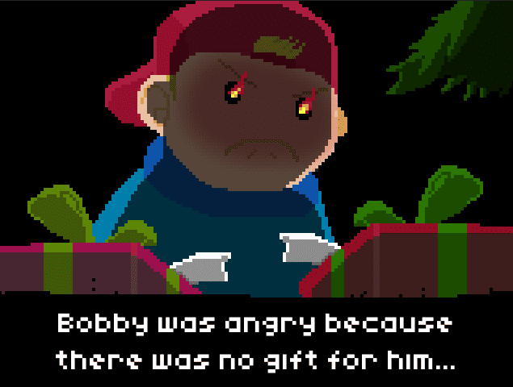

# Naughty Bobby
## Uploaded on 13th September, 2020
## desktop gamejam all
<i class="fas fa-link"></i> Game Page: <a href="https://back-body-hurts.itch.io/naughty-bobby">https://back-body-hurts.itch.io/naughty-bobby</a>

Naughty Bobby was made for the Christmas Game Jam 2018 in two days. It is  about the story of a naughty boy named Bobby who goes on an adventure to defeat Santa for not giving him a present for this Christmas. Naughty Bobby was the firs game jam I attended and it was together with Roger and Youri. We were looking to fill in the breaks between periods and practice a little. Looking back on the codebase, I involuntarily combust and vomit my insides, but as a wise man once said, thats a sign of growth.

The game consists of three stages, firstly Bobby fights to enter the north pole from the skies. Secondly, he fights his way to Santa, and lastly defeats Santa himself. It sounds like a lot, but for an experienced developer it isn't (I am updating all past projects so they perform and look well). Each stage except for the last (boss fight) consists of a number of waves of elves that Bobby needs to beat up to advance the story. Those elves are pre-defined NPCs that spawn at specific spots defined by the designer or developer.

<video src="../../../games/game_jams/naughty_bobby/images/stage_1.mp4" controls="" autoplay="" loop="" style="display: block;"></video>

The stages system is inspired from Little Fighter 2 where you have to beat a cetrain amount of waves of hostiles in order to advance the story. But obviously, it is used in a lot more games like Devil May Cry 3.

<video src="../../../games/game_jams/naughty_bobby/images/stage_2.mp4" controls="" autoplay="" loop="" style="display: block;"></video>

The environment of the game is surprisingly static, which I think I should've focused more on since the north pole is a sight to see and recreating it accurately would be an amazing experience. I added some form of generation of clouds and flora (and snowmen) but it functions pretty badly seeing as I had a peanut brain back in late 2018:

<video src="../../../games/game_jams/naughty_bobby/images/environment.mp4" controls="" autoplay="" loop="" style="display: block;"></video>

Overall, unbelievably bad programming, but for a first game atleast it can play from start to finish and taught me stuff I should've known how to do in the first place. Really nice first game jam experience.

  
... project created by

  

    

      <i class="profession-icon fas fa-code"></i>
    

    

      <h5 class="card-title">Nikolay Ivanov</h5>
      
Programmer for the whole project and also helped design it.

    

  

  

    

      <i class="profession-icon fas fa-palette"></i>
    

    

      <h5 class="card-title">Roger Recaldini</h5>
  
Together with Youri, created the visuals for the game and wrote the narrative.

    

  

  

    

      <i class="profession-icon fas fa-palette"></i>
    

    

      <h5 class="card-title">Youri Mulder</h5>
      
Together with Roger, created the visuals for the game and wrote the narrative.

    

  

  

    

    

  

