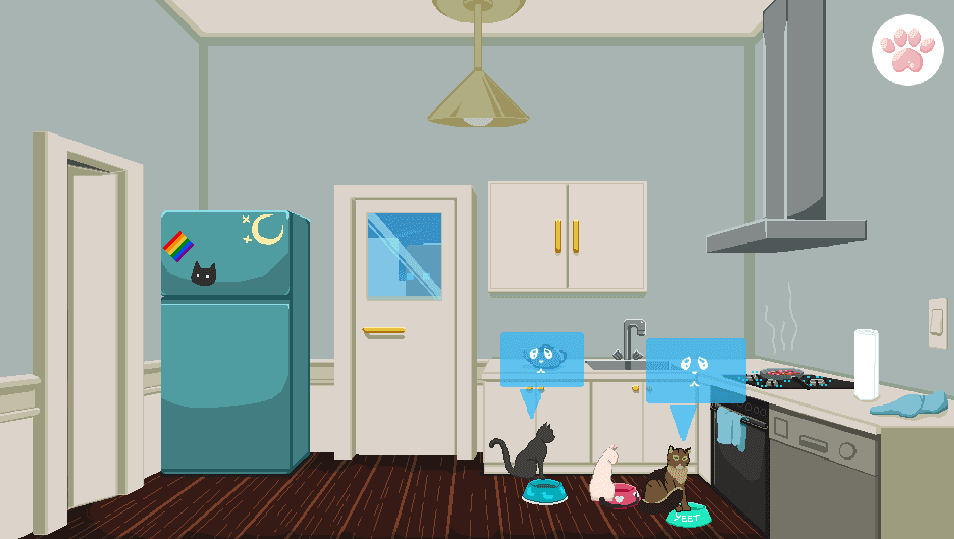
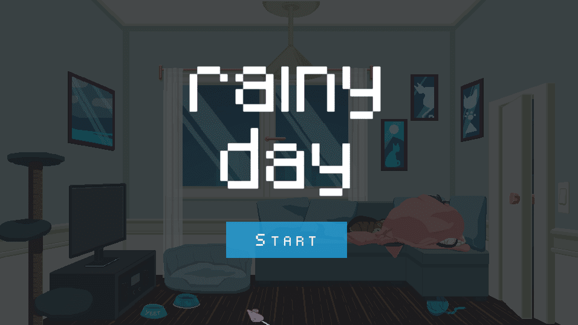

    

        
    

    

        
    

# Rainy Day
## desktop gamejam all

Rainy day, a 'calm',  short point-and-click experience of coming home to three needy cats before retiring for the night. Rainy day was created for the TasJam LITE game jam. The theme was 'calm' which lead us to create a short point-and-click experience of coming home to 3 needy cats before retiring for the night. The game was developed over 3.5 days, including concepting & implementation.

###### Credits
* Game Developer: Nikolay Ivanov
* Game Artist: Roger Recaldini

The music and sound effects used can be found here:
* Stereo song: [https://soundcloud.com/dna-groove/fabric-of-time-pocket-tanks-in-game](https://soundcloud.com/dna-groove/fabric-of-time-pocket-tanks-in-game)
* Stereo song: [https://soundcloud.com/betamaxtapes/clean-coffee](https://soundcloud.com/betamaxtapes/clean-coffee)
* Stereo song: [https://soundcloud.com/w00ds/pink-skies](https://soundcloud.com/w00ds/pink-skies)
* Rain background music: [https://freesound.org/people/Anthousai/sounds/398740/](https://freesound.org/people/Anthousai/sounds/398740/)
