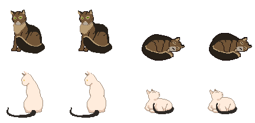

# Rainy Day
## desktop gamejam all
<span class="game-link">Game Page: <a href="https://back-body-hurts.itch.io/rainy-day">https://back-body-hurts.itch.io/rainy-day</a></span>

<p class="description"><span class="drop">R</span>ainy Day, a 'calm',  short point-and-click experience of coming home to three needy cats before retiring for the night. Rainy day was created for the TasJam LITE game jam. The theme was 'calm' which lead us to create a short point-and-click experience of coming home to 3 needy cats before retiring for the night. The game was developed over 3.5 days, including concepting & implementation. Rainy Day had to be updated after it was released after the game jam, since it was more complex and time-consuming than we thoguht, and also because I was a noob back then and couldn't keep up with the jam pace. The mechanics are simple. You take care of three cats for the duration of one evening. This means you have to feed, pet and pander to them. Before I get to explain how you do that, I want to show you how the cats work themselves.</p>



Each cat contains a state object which defines how each of its characteristics (hunger, happiness, fatigue) change over time. Each second that passes in the game changes them and makes sure the cats appear the way they should. If a cat is walking, then its fatigue should be increasing, its mood improving since in my book movement/exercise is healthy and the appearance (sprite) should look like its walking:

````c#
public abstract class CatState {
    ...

    protected virtual void SetVariables(
        float happiness, float hunger, float fatigue) {

        this.happiness_change = happiness;
        this.hunger_change = hunger;
        this.fatigue_change = fatigue;
    }

    // Every second changes to the cat
    // characteristics happen here
    public virtual void Cycle(Cat cat) {
        cat.Happiness += this.happiness_change; // Could be positive or negative
        cat.Hunger += this.hunger_change;
        cat.Fatigue += this.fatigue_change;
    }

    // Gives the cat a new spritesheet of animations
    // when switching to said state
    protected virtual void SetAnimator(RuntimeAnimatorController animator) {
        this.animator = animator;
    }
}
````

These states govern how cats behave and need/expect out of the player at any given moment. Since this state is hard to convey by simply looking at the cat or listening to the sounds it makes, I added a speech bubble for each cat that uses Japanese kaomoji to help the player understand how each cat is feeling at different times:

<video src="../../../games/game_jams/rainy_day/images/cats_kaomoji.mp4" controls="" autoplay="" loop="" style="display: block;"></video>

````c#
public void SendNotification(Mood notification_type) {
    if (ExistNotification(notification_type)) { return; }

    var notification = Instantiate(notification_prefab, list_layout.transform);
    var notification_type_string = notification_type.ToString();

    switch (notification_type) {
        case Mood.Hungry:
            notification.GetComponent<Text>().text = "(￣﹃￣)";
            break;
        case Mood.Tired:
            notification.GetComponent<Text>().text = "(￣ヘ￣)";
            break;
        case Mood.Hungry_and_tired:
            notification.GetComponent<Text>().text = "(｡╯︵╰｡)";
            break;
        case Mood.Happy:
            notification.GetComponent<Text>().text = "(￣ω￣)";
            break;
        case Mood.Purry:
            notification.GetComponent<Text>().text = "(≧◡≦)♡";
            break;
        case Mood.Playing:
            notification.GetComponent<Text>().text = "ヽ(♡‿♡)ノ";
            break;
        case Mood.Sleeping:
            notification.GetComponent<Text>().text = "(￣ρ￣)..";
            break;
    }

    notifications.Add(notification_type_string);
    notifications_objects.Add(notification);

    Toggle();
}
````

Now, there are numerous ways of externally changing cats' states. This is where the player comes in. Using objects in each room, the player can trigger activities for the cats. The living room, for example, has a mouse toy and a yarn ball which if places near a cat that is bored or not happy, can make it play with the toy to improve those stats. When a new activity starts, the cat will change its state for a short while (we don't have a cat playing animation):

<video src="../../../games/game_jams/rainy_day/images/cat_playing.mp4" controls="" autoplay="" loop="" style="display: block;"></video>

The most important obstacle to overcome is making food, since when cats are too hungry they won't care about anything else. Once you cook a meal from the kitchen, the cats will walk to the bowl and finish their meal. The process of walking in rooms is really simple. Each room has pre-defined waypoints that cats walk to. Whenever cats are hungry, they just walk to a specific object rather than a waypoint. Then they stay there for a short amount of time before they go back to normal:

<video src="../../../games/game_jams/rainy_day/images/cats_waypoints.mp4" controls="" autoplay="" loop="" style="display: block;"></video>

````c#
private WaypointController GetRandomWaypoint(bool ignore_origin) {
    if (waypoint != null) {
        waypoint.is_waypoint_occupied = false;
    }
    var availablewaypoints = new List<WaypointController>();

    for (var i = 0; i < room.waypoints.waypoints.Count; i++) {
        var current_waypoint = room.waypoints.waypoints[i];

        // Origin waypoint is the one that lets cats move
        // from one room to another. If disabled or ignore_origin
        // is set to true, they won't be able to leave the room.
        if (ignore_origin == true) {
            if (current_waypoint.type != WaypointType.Origin) {
                if (current_waypoint.is_waypoint_occupied == false) {
                    availablewaypoints.Add(current_waypoint);
                }
            }
        } else {
            // Cat's shouldnt be on top of the same waypoint
            // One waypoint for one cat, no more.
            if (current_waypoint.is_waypoint_occupied == false) {
                availablewaypoints.Add(current_waypoint);
            }
        }
    }

    // Makes sure that we get a random waypoint
    var new_waypoint = availablewaypoints[
        Random.Range(0, availablewaypoints.Count)];

    new_waypoint.is_waypoint_occupied = true;

    return new_waypoint;
}
````

<div class="credits">
  <p>... project created by</p>
</div>

<div class="card-deck">
  <div class="card">
    <div class="icon">
      <i class="profession-icon fas fa-code"></i>
    </div>
    <div class="card-body">
      <h5 class="card-title">Nikolay Ivanov</h5>
      <p class="card-text">Programmer for the whole project and also helped design it.</p>
    </div>
  </div>
  <div class="card">
    <div class="icon">
      <i class="profession-icon fas fa-palette"></i>
    </div>
    <div class="card-body">
      <h5 class="card-title">Roger Recaldini</h5>
      <p class="card-text">Responsible for all of the visual assets of the game and also worked on the design.</p>
    </div>
  </div>
</div>
</div>