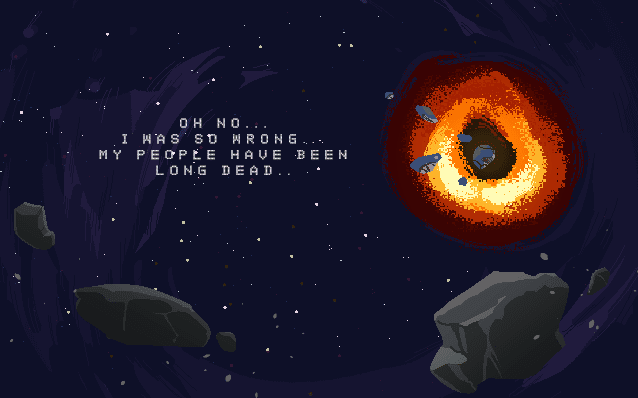

<!--<div id="carouselExampleIndicators" class="carousel slide" data-ride="carousel">
  <ol class="carousel-indicators">
    <li data-target="#carouselExampleIndicators" data-slide-to="0" class="active"></li>
    <li data-target="#carouselExampleIndicators" data-slide-to="1"></li>
    <li data-target="#carouselExampleIndicators" data-slide-to="2"></li>
  </ol>
  <div class="carousel-inner">
    <div class="carousel-item active">
      
    </div>
    <div class="carousel-item">
      
    </div>
    <div class="carousel-item">
      
    </div>
  </div>
  <a class="carousel-control-prev" href="#carouselExampleIndicators" role="button" data-slide="prev">
    <span class="carousel-control-prev-icon" aria-hidden="true"></span>
    <span class="sr-only">Previous</span>
  </a>
  <a class="carousel-control-next" href="#carouselExampleIndicators" role="button" data-slide="next">
    <span class="carousel-control-next-icon" aria-hidden="true"></span>
    <span class="sr-only">Next</span>
  </a>
</div>
-->

# Star Lens
## desktop gamejam sci-fi all
<span class="game-link">Game Page: <a href="https://back-body-hurts.itch.io/space-lens-cgj-2019-entry">https://back-body-hurts.itch.io/space-lens-cgj-2019-entry</a></span>

<p class="description"><span class="drop">S</span>tar Lens is a game in which, due to a malfunction, you wake up from your stasis chamber a thousand years later than you were meant to. Your space ship has drifted far, far away from home and once you discover how critical your situation has become over the past years, you begin to search in stars to find a way back to Earth. The idea was that the user would have a map of the stars and using that map, he would have to find specific landmarks. It's some sort of a "Can you find Waldo" type of game, but in space. In order to generate a star map full of stars, I used a simple graphical circle as a canvas and on top of it picked random spots for placing solar systems:</p>


````c#
for (int i = 0; i < pixels.Length; i++) {
    Color currentPixel = pixels[i];
    if (currentPixel.r == 0 && // We are looking for a black pixel
        currentPixel.g == 0 && // to generate a star system on top of
        currentPixel.b == 0 &&
        currentPixel.a == 1) {

        // If there is a chance a star system will be created
        // in this pixel of the circle graphic...
        if (Random.Range(0, 10000) > 9965)
        {
            // Create a star out of six different pre-defined star objects
            int randomStarPrefabIndex = Random.Range(0, 6);
            GameObject star = Resources.Load<GameObject>("Space Objects Prefabs/Star " + randomStarPrefabIndex);
            GameObject obj = Instantiate(star, starsContainer);

            // Move the new star in its place on the circle graphic canvas
            Transform objTransform = obj.GetComponent<Transform>();
            Vector3 new_position = new Vector3(((i % texture_width) * 0.01f) - ((texture_width / 2) * 0.01f), (-((i / texture_width) * 0.01f)) + ((texture_height / 2) * 0.01f), 0);
            objTransform.position = new_position;
        }
    }
}
````

This is on Editor-level, as this map will be used to add extra stuff on top of it and is simply used as eye-candy. You can see how it works in slow motion on top. Now, each star system has a name to identify itself in the game, so that the player can bookmark it or remember its location easier:


That's mostly the use of the stars and they are, in my opinion, the prettiest thing to look at whenever they're being generated (of course, I slowed down the generation process so you can understand how it works). For the final background of the playable environment (space) we add a few galaxies behind the stars, the landmarks we mentioned a while back and dark matter for eye-candy:


The second mechanic that turned out really well was the "lens". They help the player navigate the screen by left and right clicking to zoom and select celestial objects. This is done by using two Camera objects, one that captures the entire screen (not including the UI) and another that becomes visible whenever the user's mouse enters the "main screen" of the shit's interface with all the stars:


````c#
Vector3 mousePosition = Input.mousePosition;

if ((mousePosition.x > Mathf.Abs(ConsoleDisplay.rectTransform.anchoredPosition.x) &&
     mousePosition.x < ConsoleDisplay.rectTransform.sizeDelta.x) &&
    ((mousePosition.y > -Mathf.Abs(ConsoleDisplay.rectTransform.anchoredPosition.y) + 80 &&
      mousePosition.y < ConsoleDisplay.rectTransform.sizeDelta.y))) {

    LensGlass.gameObject.SetActive(true);
    Vector3 newCameraPosition = Camera.main.ScreenToWorldPoint(Input.mousePosition);
    Vector3 newLensPosition = Camera.main.ScreenToWorldPoint(Input.mousePosition);
    transform.position = newLensPosition;
    LensGlass.position = Input.mousePosition;
    LensGlassCamera.position = newCameraPosition;
    CanCameraZoom = true;
} else {
    CanCameraZoom = false;
    LensGlass.gameObject.SetActive(false);
}
````

These lens will follow the cursor of the player as long as its within the stars screen boundaries. There's also a cute mouse icon on top to help the user learn how to use the controls. The goal is that the player has to find all the landmarks using the lens, and when found the ship will be able to "triangulate" the position of Earth so that you can return the player character home.