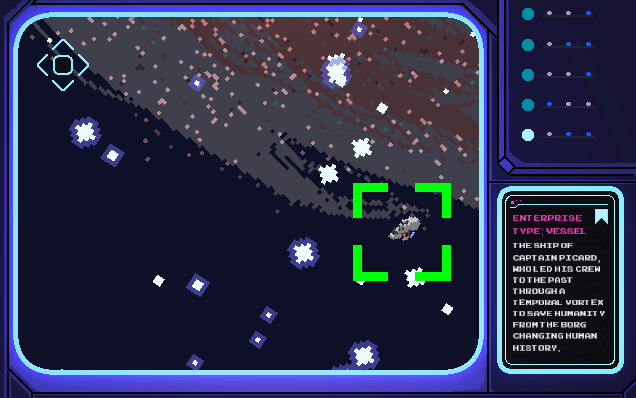
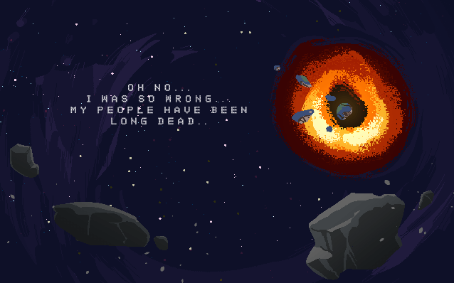

    
    

        
        
    

### Star Lens
##### desktop gamejam sci-fi all

Star Lens is a game in which, due to a malfunction, you wake up from your stasis chamber a thousand years later than you were meant to. Your space ship has drifted far, far away from home and once you discover how critical your situation has become over the past years, you begin to search in stars to find a way back to Earth.

###### Controls

The controls of the game are simple. You navigate the "Star view" (image in the bottom) using your mouse and you can zoom in and out of a region of space by right clicking. After you zoom in, you can move your scope around using the arrow or WSAD keys.

###### Credits

* Game Developer: Nikolay Ivanov
* Game Artist: Roger Recaldini
* Game Designer: Youri Mulder

All Sound effects are obtained from [https://www.zapsplat.com](https://www.zapsplat.com).
