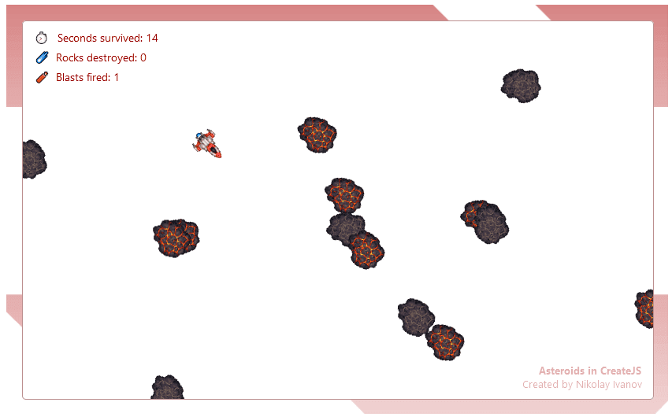
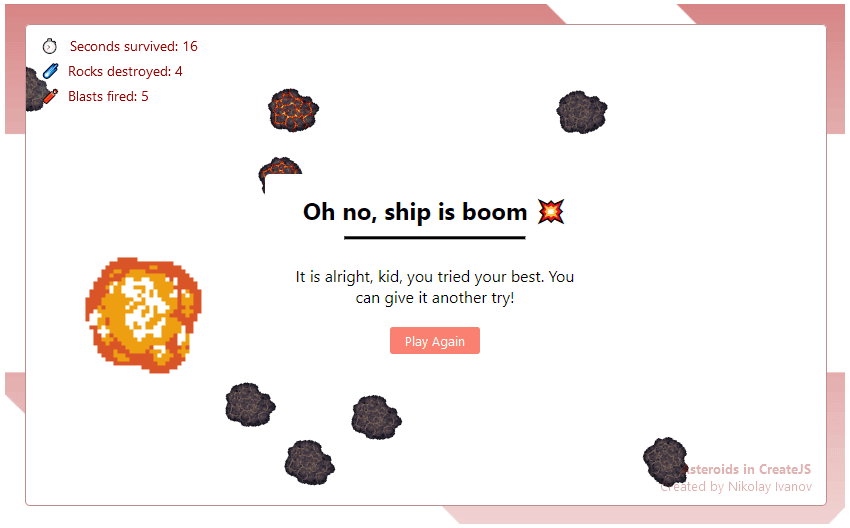

  <ol class="carousel-indicators">
    <li data-target="#carouselExampleIndicators" data-slide-to="0" class="active"></li>
    <li data-target="#carouselExampleIndicators" data-slide-to="1"></li>
    <li data-target="#carouselExampleIndicators" data-slide-to="2"></li>
  </ol>
  

    

      
    

    

      
    

    

      
    

  

  <a class="carousel-control-prev" href="#carouselExampleIndicators" role="button" data-slide="prev">
    
    Previous
  </a>
  <a class="carousel-control-next" href="#carouselExampleIndicators" role="button" data-slide="next">
    
    Next
  </a>

# Asteroids in CreateJS
## web all

Asteroids in CreateJS is a small arcade game that I recreated to learn how to use the CreateJS suite of tools such as EaselJS, PreloadJS, AudioJS and TweenJS. Development of the project was a little more than three days and sometimes It felt a bit like programming with PhaserJS. The game loop is simple to program and is a quick way learn, on a beginner level, how to use all CreateJS tools.

###### Credits

* Ship explosion: [https://opengameart.org/content/explosion-3](https://opengameart.org/content/explosion-3)
* Emojis: [https://emojipedia.org/](https://emojipedia.org/)
* Canvas background panel: [https://opengameart.org/content/sci-fi-ui-panel](https://opengameart.org/content/sci-fi-ui-panel)
* Ship and asteroids sprites: [https://opengameart.org/content/shmup-ships](https://opengameart.org/content/shmup-ships)
* Asteroid explosion: [https://freesound.org/people/studiomandragore/sounds/401628/](https://freesound.org/people/studiomandragore/sounds/401628/)
* Ship blast sound: [https://freesound.org/people/kafokafo/sounds/128229/](https://freesound.org/people/kafokafo/sounds/128229/)
* Ship explosion sound: [https://freesound.org/people/cydon/sounds/268557/](https://freesound.org/people/cydon/sounds/268557/)
* Background music: [https://www.youtube.com/watch?v=JCLgHXuqayM](https://www.youtube.com/watch?v=JCLgHXuqayM)
* Ship engine sound: [https://freesound.org/people/hykenfreak/sounds/214663/](https://freesound.org/people/hykenfreak/sounds/214663/)