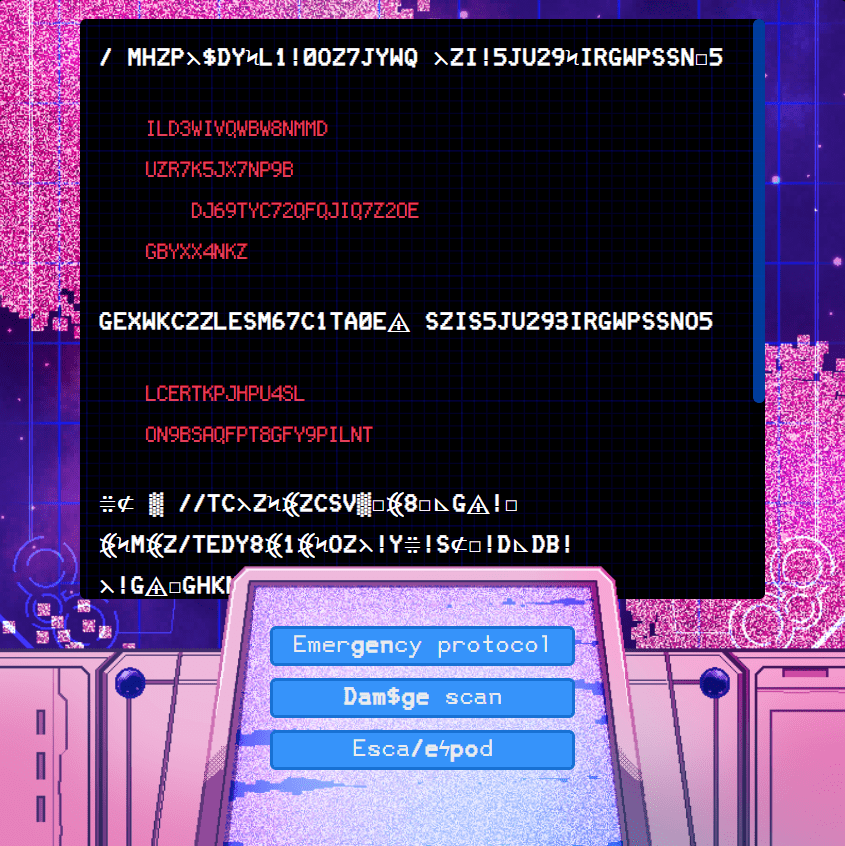
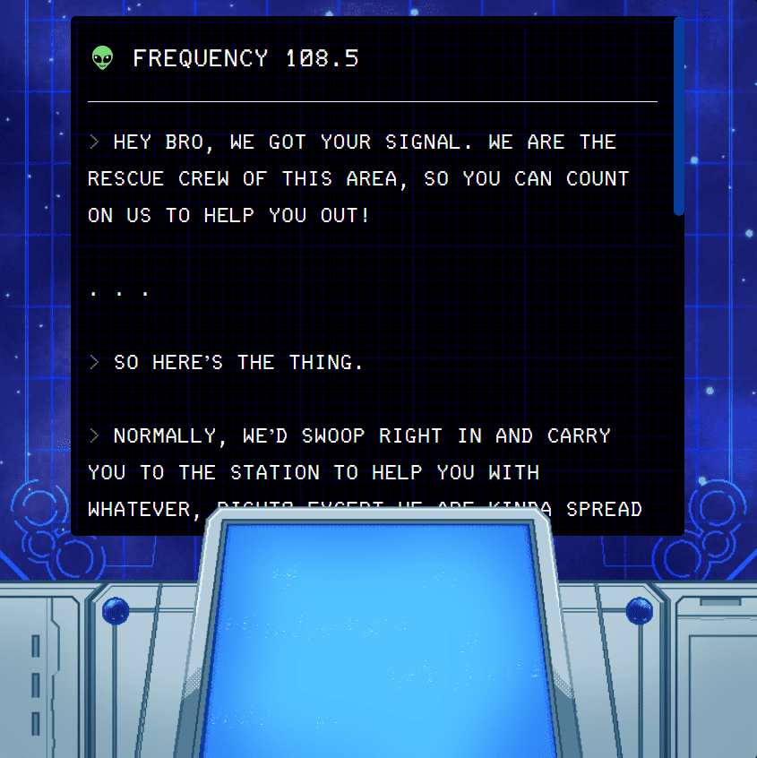
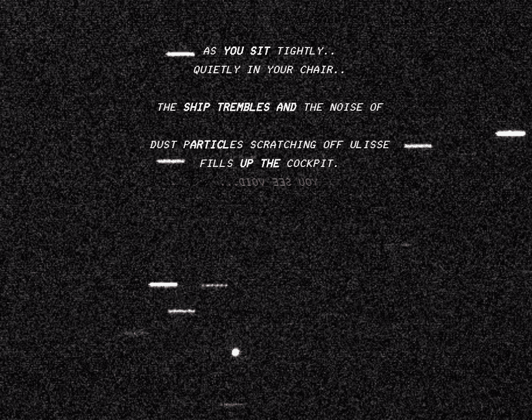

    

        
    

    

        
    

# Cosmic Relay
## web all twine2
Game Page: <a href="https://back-body-hurts.itch.io/cosmic-relay">https://back-body-hurts.itch.io/cosmic-relay</a>

A short interactive pick your path game created for the I Can't Write But Want To Tell A Story Jam of 2020.

In Cosmic Relay you play as an unfortunate traveler trying to pick the right choices to make it out alive. "Right" being a relative term. You have to help your character survive through the dangerous space filled with pirates and aliens waiting just around the corner using just your screen and console.

###### Controls
Click on the buttons in the bottom console to make your choice, or on the red text when the bottom console isn't available. Use the CTRL key to skip loading text if you don't feel like waiting.

###### Credits
* Game Artist - Roger Recaldini
* Game Designer and Artist - Youri Mulder
* Game Developer - Nikolay Ivanov

The sound effect for the loading text used is called "UI, Mechanical, Text-Scroll, 03, FX, 01, LOOP.wav" by InspectorJ ([www.jshaw.co.uk](http://www.jshaw.co.uk/)) retrieved from [https://freesound.org/people/InspectorJ/sounds/458587/](https://freesound.org/people/InspectorJ/sounds/458587/).

The art assets were created in Clip Studio Paint with the contribution of [https://assets.clip-studio.com/en-us/detail?id=1719532](https://assets.clip-studio.com/en-us/detail?id=1719532).