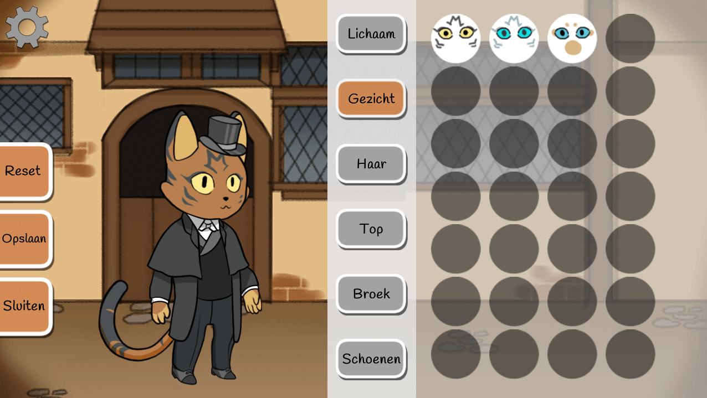

    
    

        
        
    

### Morgan Travels Through Time
##### narrative mobile all

Morgan reist door de tijd is a game series about a child from 2019 who accidentally ends up in 1672 as they followed the neighbor's kid. Morgan needs to find their way back to their own time. In their quest to get back to 2019 they must also prevent the future from being changed by the neighbor's kid. The first installment of the game series, called Morgan & Bommen Berend , introduces the player to Morgan’s story and takens them along on a journey through the events of Bommen Berend. 

###### Mechanics

In this game the player can move back and forth through several locations for a multitude of activities. The quest of the player, to return home without having changed the past and thus the future, can be completed by interacting with NPCs, solving missions and doing puzzles of various kinds. Helping others and paying attention to the surroundings will be rewarded in the game. As the game is aimed at touch screen devices such as mobile phones and tablets, the interaction with the game will be via touch screen motions. The player can interact with the 6 elements on the screen, they can collect objects into their inventory and move around in areas by holding one of the two direction buttons. 

###### Credits

* Game Artist: Martin Jawahier
* Game Artist: Elisa Roger Recaldini
* Game Designer: Nathalie Smit
* Game Designer: Youri Mulder
* Game Developer: Artem Stolyga
* Game Developer: Nikolay Ivanov