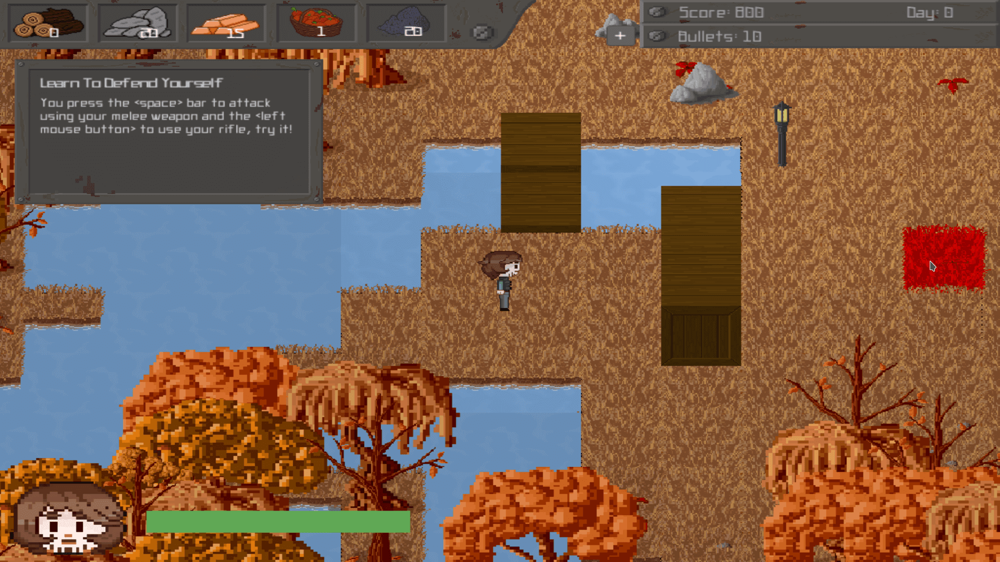
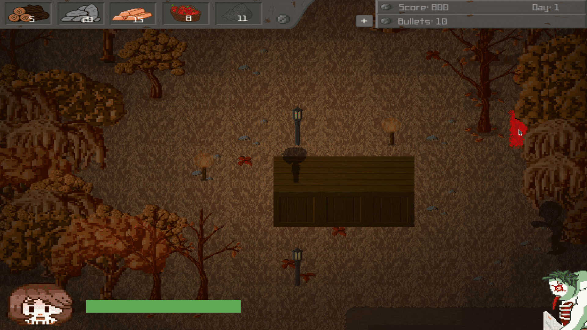
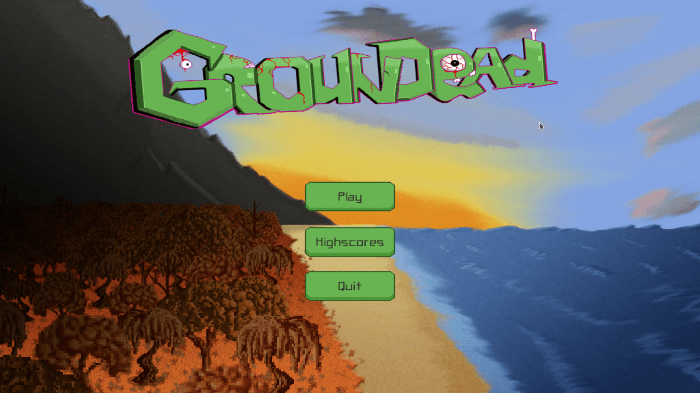

  <ol class="carousel-indicators">
    <li data-target="#carouselExampleIndicators" data-slide-to="0" class="active"></li>
    <li data-target="#carouselExampleIndicators" data-slide-to="1"></li>
    <li data-target="#carouselExampleIndicators" data-slide-to="2"></li>
  </ol>
  

    

      
    

    

      
    

    

      
    

  

  <a class="carousel-control-prev" href="#carouselExampleIndicators" role="button" data-slide="prev">
    
    Previous
  </a>
  <a class="carousel-control-next" href="#carouselExampleIndicators" role="button" data-slide="next">
    
    Next
  </a>

# Groundead
## desktop survival all
Game Page: <a href="https://back-body-hurts.itch.io/groundead">https://back-body-hurts.itch.io/groundead</a>

GrounDead is a top-down zombie survival game, wherein the player takes control of a hunter/lumberjack/carpenter, who must survive waves of zombies coming towards him with the use of multiple weapons, such a  hunting rifle, a knife, an axe, and by crafting a variety of different defensive structures, such as barricades, platforms, and traps. To control the character, the player will use a traditional keyboard and mouse control scheme to perform actions, such as moving, attacking, building, destroying and healing.

###### Credits
The game was created in roughly eight weeks by the following team members:

* Game Designer: Tatiana Mansur
* Game Designer: Petar Petrov
* Game Developer: Nikolay Ivanov
* Game Artist: Demi Enzerink
* Game Artist: Luuk van Dort
* Game Artist: Martin Jawahier
* Sound Producer: Luuk van Dort